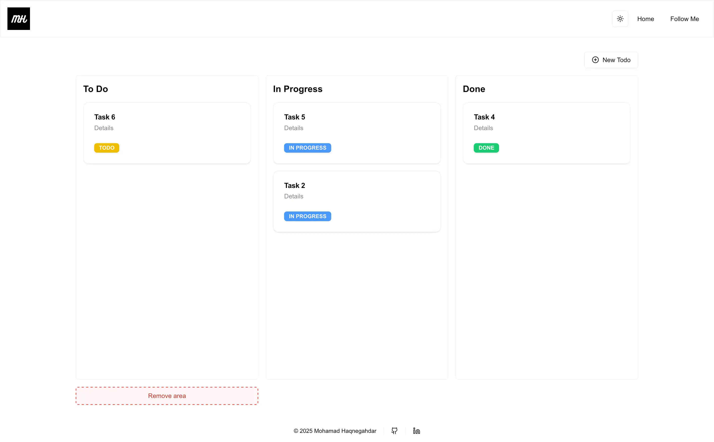

# Zustand Todo List - Nextjs v15.1.3

This is [Next.js](https://nextjs.org/) project is bootstrapped with [`create-next-app`](https://github.com/vercel/next.js/tree/canary/packages/create-next-app). You can use this project as a refrence and create your stores using **Zustand**. Also it is a good example of implementing **DND-Kit** library for drag and drop.

Explore the [demo](https://draggable-zustand-todolist.vercel.app/) for better understanding.

[Note.md](./Note.md) for more info on the process.

## Technologies

- TSX, Tailwindcss,
- TypeScript
- **Nextjs v15**
- **Packages:** Zustand, DND-Kit
- **Routing:** using new app directory

## Features

- Store management using **Zustand**
- **DND-Kit** for drag and drop
- **Persistance** Middleware using **Zustand**

## Installation

###### shell command

```shell
bun install

bun run dev
```
or

```shell
npm install

npm run dev
```

## Screenshots


